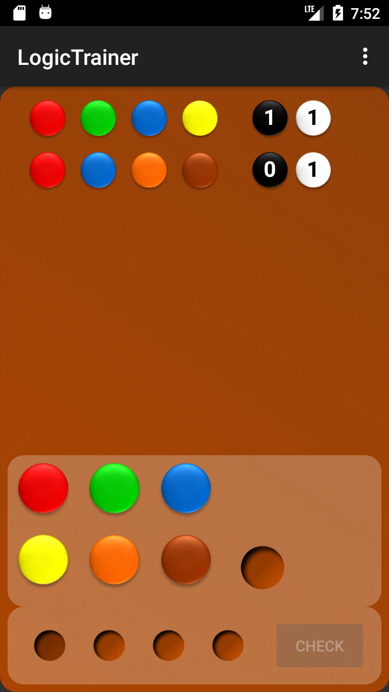
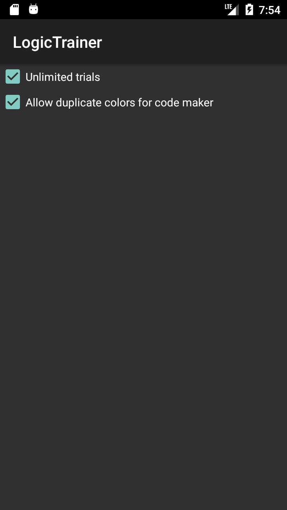

# LogicTrainer

Yet another Mastermind clone for Android.
Name based on the Mastermind clone [Logic Trainer](https://www.ddr-museum.de/objectdatabase/daphne/3/33867.pressedownload.jpg).

This was my very first Android project. The game is not available in the Play Store.

## The Game

You are a code breaker. Your goal is to guess a code consisting of four places. The code maker has 6 colors to choose from. If the Option "Allow duplicate colors for code maker" is checked, a color could be in the code multiple times, otherwise colors are distinct.

Use the code breaker panel below to enter your guess. Press the "Check" button to check your guess. The result shows up as a new line in the upper part of the screen with your guess and a black and white button containing the number of correct colors (black = correct color and position, white = correct color at incorrect position).

You have 7 guesses, unless the Option "Unlimited trials" is checked.

    Note: The game supports gestures:
      * Draw an "N" to create a new game.
      * Draw an "O" to show the Options screen.

## Screenshots

### The Game with Color Chooser for Code Breaker

### Game Options

